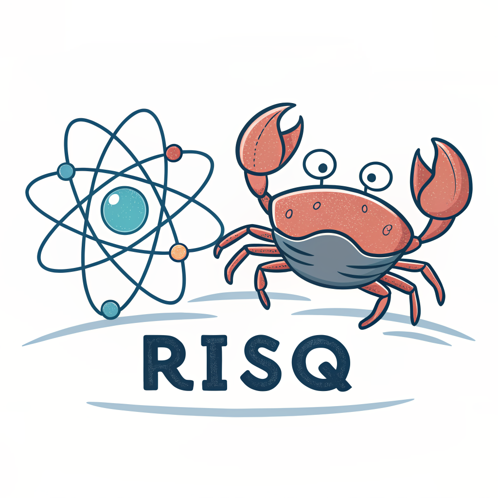

# Rust Implementation of Semistochastic Quantum chemistry (RISQ)



**Note:** This is research code developed during PhD and postdoctoral work, primarily focused on implementing and testing specific electronic structure methods. It may lack the polish, flexibility, and extensive testing of production software.

## Overview

RISQ provides Rust implementations of several advanced electronic structure algorithms designed to tackle challenging molecular systems where electron correlation is strong. The primary focus is on selected Configuration Interaction (CI) methods and their combination with semistochastic techniques to achieve high accuracy efficiently.

Key methods implemented include:

*   Heat-bath Configuration Interaction (HCI)
*   Semistochastic Epstein-Nesbet Perturbation Theory (often combined with HCI, termed SHCI)
*   Dynamic Semistochastic Full CI Quantum Monte Carlo (DS-FCIQMC)

## Features

*   **Heat-bath Configuration Interaction (HCI):** An efficient deterministic selected CI method for generating compact, variationally optimal wavefunctions in a chosen active space.
*   **Semistochastic Epstein-Nesbet Perturbation Theory:** Calculates the second-order perturbative correction to the HCI energy, significantly improving accuracy by accounting for interactions outside the variational space using a combination of deterministic and stochastic sampling techniques. (Note: Strongly-Contracted NEVPT2 is marked as WIP in the source).
*   **Dynamic Semistochastic Full CI Quantum Monte Carlo (DS-FCIQMC):** A projector QMC method that aims to find the ground state energy within the Full CI space. This implementation features a dynamic splitting between the deterministic and stochastic parts of the simulation.
*   **Performance:** Utilizes efficient algorithms and data structures, including bit manipulation for determinant handling, sparse matrix algebra (Davidson algorithm), and Alias sampling for stochastic components.

## Build Instructions

1.  **Install Rust:** Follow the instructions at [rustup.rs](https://rustup.rs/). RISQ is developed using the Rust 2018 edition.
2.  **Clone the repository:**
    ```bash
    git clone <repository-url>
    cd risq
    ```
3.  **Build the executable:**
    ```bash
    cargo build --release
    ```
    The executable will be located at `target/release/risq`.

## Usage

RISQ runs as a command-line application, reading parameters from `in.json` and molecular integrals from an `FCIDUMP` file located in the same directory where the command is executed.

1.  **Prepare Input Files:**
    *   **`FCIDUMP`:** A standard text file containing the one- and two-electron integrals for the molecular system. These can typically be generated by other quantum chemistry packages (PySCF, Molpro, Psi4, etc.). Ensure the file is named exactly `FCIDUMP`.
    *   **`in.json`:** A JSON file specifying calculation parameters. Key parameters include:
        *   `n_orbs`: Number of spatial orbitals.
        *   `n_elec`: Number of electrons.
        *   `n_frozen`: Number of frozen core orbitals (optional).
        *   `eps_vars`: Variational screening threshold for HCI (e.g., `1.0e-4`). Determines the size of the variational space.
        *   `eps_pt`: Perturbative screening threshold (e.g., `1.0e-6`). Determines which determinants contribute to the PT2 correction.
        *   `max_iter_var`: Maximum iterations for the variational stage.
        *   `max_iter_pt`: Maximum iterations or samples for the PT stage.
        *   *(Other parameters specific to DS-FCIQMC or different PT variants might exist)*

    Refer to the `examples/` directory for sample `in.json` files.

2.  **Run the Calculation:**
    Navigate to the directory containing `in.json` and `FCIDUMP`, then execute the compiled binary:
    ```bash
    # Assuming risq executable is in your PATH or you provide the full path
    /path/to/your/risq/target/release/risq
    ```
    Or, run directly from the project root if inputs are there:
    ```bash
    cargo run --release
    ```
    Output will be printed to the standard output.

3.  **Examples:**
    Working examples for various systems can be found in the `examples/` directory. Each subdirectory typically contains the necessary `FCIDUMP` and `in.json` files.

## Design Choices and Implementation Details

*   **Language (Rust):** Chosen for its performance characteristics (comparable to C/C++), memory safety guarantees (reducing bugs common in complex scientific codes), and excellent tooling (Cargo, rustfmt, clippy).
*   **Determinant Representation:** Slater determinants (`Config` struct) are represented using bitstrings (`u128` for alpha and beta spins). This allows for highly efficient storage and manipulation using bitwise operations (checking occupations, calculating parity for permutation signs), which is crucial for CI/QMC performance. See `src/utils/bits.rs` and `src/wf/det.rs`.
*   **Hamiltonian Generation:** Matrix elements are calculated on-the-fly using Slater-Condon rules implemented in `src/ham/mod.rs`. For the variational stage, a sparse Hamiltonian matrix is constructed.
*   **Variational Solver:** The Davidson iterative algorithm (`src/var/davidson.rs`) is used to find the lowest eigenvalue(s) of the sparse Hamiltonian matrix generated in the HCI step. Custom sparse matrix formats (`src/var/sparse.rs`) are used.
*   **Stochastic Sampling:** Alias sampling (`src/stoch/alias.rs`) is implemented for efficient O(1) sampling from discrete probability distributions, used in the semistochastic PT and potentially DS-FCIQMC components.
*   **Architecture Limitation:** The code is currently structured as a command-line binary that reads hardcoded filenames (`in.json`, `FCIDUMP`) using global static variables (`lazy_static!` in `src/main.rs`). While functional for specific research runs, this limits flexibility, reusability as a library, and testability. Refactoring to pass configuration and data explicitly would be a significant improvement for general use.

## Documentation

Generated documentation for the Rust code can be found at [https://aaholmes.github.io/risq/](https://aaholmes.github.io/risq/).

You can also generate and view the documentation locally:
```bash
cargo doc --no-deps --open
```

## Citations

If you use this code or the methods implemented, please consider citing the relevant publications:

*   **HCI:**
    *   Holmes, A. A.; Tubman, N. M.; Umrigar, C. J. *J. Chem. Theory Comput.* **2016**, *12*, 3674–3680. ([DOI: 10.1021/acs.jctc.6b00407](https://doi.org/10.1021/acs.jctc.6b00407))
    *   Sharma, S.; Holmes, A. A.; Jeanmairet, G.; Alavi, A.; Umrigar, C. J. *J. Chem. Theory Comput.* **2017**, *13*, 1595–1604. ([DOI: 10.1021/acs.jctc.6b01028](https://doi.org/10.1021/acs.jctc.6b01028))
*   **Semistochastic HCI (Epstein-Nesbet PT):**
    *   Li, J.; Otten, M.; Holmes, A. A.; Sharma, S.; Umrigar, C. J. *J. Chem. Phys.* **2018**, *149*, 214105. ([DOI: 10.1063/1.5055390](https://doi.org/10.1063/1.5055390))

## License

This project is licensed under the **MIT License**. See the `LICENSE` file in the root directory.
